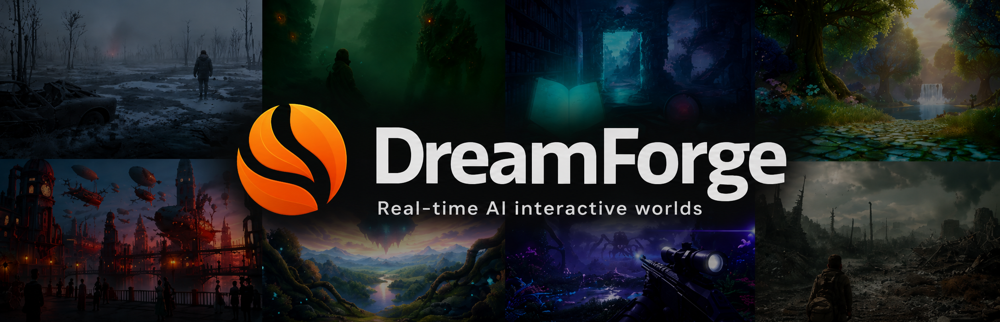
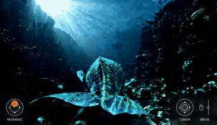
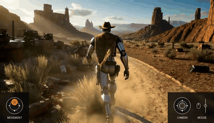

<div align="center">



# DreamForge-World 0.1 Preview

### A low-compute, real-time controllable world model

**Daniyel Ayupov · Artur Markov-Tsoy**  
DreamForge AI Lab

[](https://trydreamforge.com/research)
[](https://arxiv.org/abs/2606.30292)
[](https://huggingface.co/papers/2606.30292)

</div>

---

**DreamForge-World 0.1 Preview** is an action-conditioned visual world model for real-time interactive world simulation. It generates the visible world frame by frame in a closed autoregressive loop, conditioned on visual history, text, and live keyboard and mouse input.

The project explores a complementary axis to frontier-scale world simulators: broad interactive capability, consumer-GPU runtime, and low-compute adaptation of open video-generation backbones.

> [!NOTE]
> This repository currently hosts the paper, demos, and public project materials. **Code and model weights for DF-World 0.1 Preview will not be released.** Releasing code and model weights for **DF-World 0.5** is the current target, subject to final evaluation, licensing, and release readiness.

## 🎬 Video Examples

The clips below show interactive rollouts across realistic, stylized, first-person, and third-person environments.

<table align="center">
  <tr>
    <td width="50%" align="center">
      
      <br><sub><b>Apocalypse</b> · <a href="assets/clips/apocalypse_overlay.mp4">open clip</a></sub>
    </td>
    <td width="50%" align="center">
      
      <br><sub><b>River Boat</b> · <a href="assets/clips/boat_overlay.mp4">open clip</a></sub>
    </td>
  </tr>
  <tr>
    <td width="50%" align="center">
      
      <br><sub><b>Snowy Cabin</b> · <a href="assets/clips/cabin_overlay.mp4">open clip</a></sub>
    </td>
    <td width="50%" align="center">
      
      <br><sub><b>Cyberpunk Street</b> · <a href="assets/clips/cyberpunk_overlay.mp4">open clip</a></sub>
    </td>
  </tr>
  <tr>
    <td width="50%" align="center">
      
      <br><sub><b>Dark Fantasy</b> · <a href="assets/clips/dark-fantasy_overlay.mp4">open clip</a></sub>
    </td>
    <td width="50%" align="center">
      
      <br><sub><b>Detective Alley</b> · <a href="assets/clips/detective_overlay.mp4">open clip</a></sub>
    </td>
  </tr>
  <tr>
    <td width="50%" align="center">
      
      <br><sub><b>Deep Sea Whale</b> · <a href="assets/clips/fish_overlay.mp4">open clip</a></sub>
    </td>
    <td width="50%" align="center">
      
      <br><sub><b>Post-Apocalyptic FPS</b> · <a href="assets/clips/nuclear_overlay.mp4">open clip</a></sub>
    </td>
  </tr>
  <tr>
    <td width="50%" align="center">
      
      <br><sub><b>Robot Cowboy</b> · <a href="assets/clips/robot_overlay.mp4">open clip</a></sub>
    </td>
    <td width="50%" align="center">
      
      <br><sub><b>Sky Whale</b> · <a href="assets/clips/sky_overlay.mp4">open clip</a></sub>
    </td>
  </tr>
</table>

> Demo clips are compressed for practical repository playback and may not represent the original capture quality.

## ✨ Highlights

- **Live control:** keyboard and mouse conditioning during generation
- **Multimodal initialization:** begin from text, an image, or a video
- **Mid-stream re-prompting:** alter the generated world while the rollout is running
- **Dual perspective:** first-person and third-person interactive generation
- **Long rollouts:** minute-scale autoregressive interaction at native 480p resolution
- **Consumer-GPU operation:** real-time inference on a single high-end consumer GPU

## 🧠 How It Works

DF-World 0.1 Preview adapts the **LongLive 1** autoregressive video stack, derived from **Wan 2.1 T2V 1.3B**, and adds a residual action-conditioning pathway inspired by the **Matrix-Game** family.

At each generation step, the model receives the current visual history, textual context, and live user actions. It predicts the next frames, decodes them, and feeds the generated result back into the next step. The visible video is therefore both the output and the evolving state of the simulated world.

The system does not assemble prebuilt levels, meshes, sprites, or conventional game-engine state. It synthesizes the world directly in pixel space.

## 📍 Release Status

| Release | Research materials | Code | Model weights |
| :--- | :---: | :---: | :---: |
| **DF-World 0.1 Preview** | Available | Not planned | Not planned |
| **DF-World 0.5** | In development | Planned | Planned |

The exact scope, license, and release timing of DF-World 0.5 have not yet been finalized.

<details>
<summary><b>Current limitations of DF-World 0.1 Preview</b></summary>

- No persistent spatial world memory
- No explicit geometry, physics state, or reliable object map
- Spatial consistency is not guaranteed when revisiting earlier locations
- Noticeable control latency and limited action diversity
- No audio generation
- Autoregressive drift can accumulate during difficult or extended rollouts

</details>

## 🔗 Related Projects and Acknowledgements

DreamForge-World builds on and benefits from the open research ecosystem around video generation, autoregressive modeling, and interactive world simulation.

- [**Wan 2.1**](https://github.com/Wan-Video/Wan2.1) — the base open video-generation model underlying the DF-World 0.1 Preview stack
- [**LongLive**](https://github.com/NVlabs/LongLive) — the autoregressive video framework adapted for real-time interactive generation
- [**Matrix-Game**](https://github.com/SkyworkAI/Matrix-Game) — an important reference for action-conditioned interactive world modeling
- [**Deep Forcing**](https://github.com/cvlab-kaist/DeepForcing) — related project we used for long-horizon autoregressive video generation and context management

We thank the authors and maintainers of these projects for releasing research, code, and models that made low-compute experimentation in this area possible.

## 📝 Citation

If you find DreamForge-World useful in your research, please cite the paper:

```bibtex
@article{ayupov2026dreamforgeworld,
  title   = {DreamForge-World 0.1 Preview: A Low-Compute Real-Time Controllable World Model},
  author  = {Ayupov, Daniyel and Markov-Tsoy, Artur},
  journal = {arXiv preprint arXiv:2606.30292},
  year    = {2026}
}
```

## ⚖️ Licensing

No source code or model weights are distributed in this repository at present. All repository materials remain subject to their respective stated terms. Licenses for future code and model releases will be published alongside those releases.
